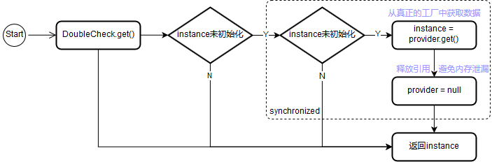

# 再看@Component

我们之前使用`@Component`都仅仅是在其注解的接口中添加一个`inject`方法，作为进行依赖注入的入口，但`@Component`的作用远不止如此

# 新需求

为了深入研究`@Component`，我们新增两个需求

## 需求1

>  在`Activity`显示`Computer`信息时，我们要求根据当前时间（`System.currentTimeMillis()`）单双作为区别，如果单数就显示`windows`，如果双数就显示`linux`

我们先考虑第一个需求，每次`Activity.onCreate()`中都会调用`inject()`方法注入`windows`和`linux`实例，但我们其实只用得上其中一个，这样岂不是造成了内存的浪费？不过不用担心，dagger为我们准备了`Lazy`接口：

```kotlin
class CaseActivity : BaseActivity() {
    @field:[Inject ComputerModule.WindowsComputerQualifier]
    lateinit var windows: dagger.Lazy<Computer> // 注意这里是dagger.Lazy，因为Kotlin中也有Lazy接口，通常用于lazy标准委托，不是本篇的重点...
    @field:[Inject ComputerModule.LinuxComputerQualifier]
    lateinit var linux: dagger.Lazy<Computer>
    @set:Inject
    lateinit var timestamp: Date
    /* ... */
    private fun show() {
        val builder = StringBuilder(timestamp.toString()).append("\n")
        if (System.currentTimeMillis() % 2 == 0L) { // 双数时显示linux
            linux.get().execute(builder)
        } else { // 单数时显示windows
            windows.get().execute(builder)
        }
        text_view.text = builder.toString()
    }
}
```

我们可以在`WindowsComputer`和`LinuxComputer`初始化块中添加Log以验证是否有被实例化：

```kotlin
class WindowsComputer(price: Int) : Computer("Windows", price) {
    init { Log.i("Computer", "WindowsComputer: init") }
}

class LinuxComputer(price: Int) : Computer("Linux", price) {
    init { Log.i("Computer", "LinuxComputer: init") }
}
```

这里就不贴出实验结果了，相信大家都能猜到，也就是说**dagger的`@Component`是支持懒加载（`Lazy`）的形式提供依赖注入的**

接下来就是源码分析了，我们先看下用到的`Lazy`接口和dagger生成的`DaggerCaseActivityComponent`有什么变化：

```java
/* dagger.Lazy */
public interface Lazy<T> {
  T get();
}
/* 下面源码去掉了Builder模式部分 */
public final class DaggerCaseActivityComponent implements CaseActivityComponent {
  private final TimestampModule timestampModule;
  // 并不像TimestampModule一样直接持有Module的引用了，而变成了持有Provider
  private Provider<Computer> provideWindowsComputerProvider;
  private Provider<Computer> provideLinuxComputerProvider;

  private DaggerCaseActivityComponent(
      ComputerModule computerModuleParam, TimestampModule timestampModuleParam) {
    this.timestampModule = timestampModuleParam;
    initialize(computerModuleParam, timestampModuleParam); // 注意这里比之前多了一个initialize方法的调用
  }

  @SuppressWarnings("unchecked")
  private void initialize(
      final ComputerModule computerModuleParam, final TimestampModule timestampModuleParam) { // 这里面做的就是将Module拆分为工厂类
    this.provideWindowsComputerProvider = ComputerModule_ProvideWindowsComputerFactory.create(computerModuleParam);
    this.provideLinuxComputerProvider = ComputerModule_ProvideLinuxComputerFactory.create(computerModuleParam);
  }

  @Override
  public void inject(CaseActivity target) {
    injectCaseActivity(target);
  }

  private CaseActivity injectCaseActivity(CaseActivity instance) {
    // 注意下面注入的是DoubleCheck.lazy返回的对象，而不像timestamp一样直接通过工厂类产生对象实例注入
    CaseActivity_MembersInjector.injectWindows(
        instance, DoubleCheck.lazy(provideWindowsComputerProvider));
    CaseActivity_MembersInjector.injectLinux(
        instance, DoubleCheck.lazy(provideLinuxComputerProvider));
    CaseActivity_MembersInjector.injectSetTimestamp(
        instance, TimestampModule_ProvideTimestampFactory.provideTimestamp(timestampModule));
    return instance;
  }
}
```

可以看到`Lazy`接口简直和`Provider`接口一模一样，不过前者**专门用于懒加载注入**，因此即使写法是一样的，但二者意义上有着很大差距

再看生成的`Component`桥接类中，回想下使用`Lazy`之前的`Component`，有这么几点变化：

1. `Component`不再直接持有`Computer`的数据仓库`ComputerModule`，而是持有将其“拆分”为根据`@Provides`生成的工厂类
2. 上述“拆分”动作发生在`Component`构造函数中，用上了我们之前分析工厂类中忽略的`create()`方法，总算找到了这个方法的使用处
3. 执行注入逻辑时，不再直接注入数据仓库或工厂类生产的对象实例，而是调用了`DoubleCheck.lazy()`这个方法

我想现在的问题肯定聚集在`DoubleCheck`这个类上了，这个类名不由得让我想起单例模式的实现方式——DCL，让我们赶紧看看：

```java
/* 我将一些注释和无关部分去掉了 */
public final class DoubleCheck<T> implements Provider<T>, Lazy<T> {
  private static final Object UNINITIALIZED = new Object();

  private volatile Provider<T> provider;
  private volatile Object instance = UNINITIALIZED;

  private DoubleCheck(Provider<T> provider) {
    assert provider != null;
    this.provider = provider;
  }

  @SuppressWarnings("unchecked") // cast only happens when result comes from the provider
  @Override
  public T get() {
    Object result = instance;
    if (result == UNINITIALIZED) {
      synchronized (this) {
        result = instance;
        if (result == UNINITIALIZED) {
          result = provider.get();
          instance = reentrantCheck(instance, result);
          provider = null;
        }
      }
    }
    return (T) result;
  }
  public static Object reentrantCheck(Object currentInstance, Object newInstance) {
    /* 这部分没看懂，总之通常都会返回newInstance */
    return newInstance;
  }
    
  public static <P extends Provider<T>, T> Lazy<T> lazy(P provider) {
    if (provider instanceof Lazy) {
      @SuppressWarnings("unchecked")
      final Lazy<T> lazy = (Lazy<T>) provider;
      return lazy;
    }
    return new DoubleCheck<T>(checkNotNull(provider));
  }
}
```

上面代码的各种细节逻辑由于个人理解能力有限，并不是很能理解，我们就挑关键部分来看。首先`DoubleCheck`对象实现了`Provider`和`Lazy`接口，其次`DoubleCkeck.lazy()`方法返回的`Lazy`对象实际上实现是`DoubleCheck`，最后`DoubleCheck`还依赖另一个`Provider`，即数据的真正提供者，我们来画一个图看下当我们调用`windows.get()`/`linux.get()`时发生了什么：



其实整体逻辑并不难理解，只有第一次调用`get()`方法时才会让`provider`/工厂类提供数据实例，从而达到一个懒加载的效果。另外注意这里虽然用上了Double Check，但**这里绝对不是一个单例**，只是因为懒加载的数据只会调用一次`provider.get()`，如果`Activity`中有个多个相同`@Qualifier`类型的`Lazy<Computer>`，自然这些实例是不同的对象

## 需求2

> 为了让页面不那么死板，要求`Activity`每秒都更新一次`timestamp`的显示（但不用修改`Computer`的信息）

按照我们之前的逻辑，`Activity`中的`timestamp`只在`inject()`是被注入，之后就不再改变了；如果要实现这个需求，我们要每隔一段时间就获取到一个新的`timestamp`实例。此时就轮到我们非常熟悉的`provider`出场了：

```kotlin
class CaseActivity : BaseActivity() {
	/* ... */
    @set:Inject
    lateinit var timestamp: Provider<Date> // 注入的是Provider
    private var isDestroy = false // 用以记录Activity的状态
    
    override fun onCreate(savedInstanceState: Bundle?) {
        /* ... */
        show()
        startRefresh()
    }
    /* ... */
	private fun startRefresh() {
        val handler = Handler()
        handler.postDelayed(object : Runnable {
            override fun run() {
                val builder = StringBuilder(text_view.text)
                builder.append(timestamp.get().toString()).append("\n")
                text_view.text = builder.toString()
                if (!isDestroy) { // 避免内存泄漏
                    handler.postDelayed(this, 1000)
                }
            }
        }, 1000)
    }

    override fun onDestroy() {
        super.onDestroy()
        isDestroy = true
    }
}
```

我们可以根据对前面`Lazy`的分析，猜猜`Provider`对生成的`Component`桥接类的影响：

```java
public final class DaggerCaseActivityComponent implements CaseActivityComponent {
  /* ... */
  private Provider<Date> provideTimestampProvider; // 也变成了持有Provider
  /* .. */
  private void initialize(final ComputerModule computerModuleParam, final TimestampModule timestampModuleParam) {
    /* ... */
    this.provideTimestampProvider =
        TimestampModule_ProvideTimestampFactory.create(timestampModuleParam); // 持有的Provider其实就是工厂类
  }
  /* ... */
  private CaseActivity injectCaseActivity(CaseActivity instance) {
     /* ... */
    CaseActivity_MembersInjector.injectSetTimestamp(instance, provideTimestampProvider); // 直接将Provider/工厂类注入（而Lazy则是通过DoubleCheck对其再次封装了下）
    return instance;
  }
  /* ... */
}
```

所以`Activity`中如果注入的是`Provider<T>`类型，那么其实持有的是`T`类型的工厂类，也就是每次调用`get()`都是从工厂类生成一个新的实例

# @Component接口中可定义的方法

`@Component`注解的接口中其实可以有很多方法，这些方法被分为两类：**成员注入类（`members-injection`）和数据提供类（`provision`）**

## 成员注入类方法

成员注入类的方法有三种写法：

```kotlin
@Component(modules = [ComputerModule::class, TimestampModule::class])
interface CaseActivityComponent {
    fun inject(target: CaseActivity) // 最简单的注入接口
    fun injectAndReturn(target: CaseActivity): CaseActivity // 注入后返回，以方便链式调用
    fun activityInjector(): MembersInjector<CaseActivity> // 返回注入器
}
```

前两个很好理解，最后一个返回注入器可以回想下，我们在分析`@Inject`注解在变量和方法上时，dagger会生成对应的`MemberInjector`对象（这里也就是我一直强调的`Component`只是桥接作用，真正的注入器应该是`MemberInjector`）。我们看下生成的`Component`中源码有什么改动：

```java
public final class DaggerCaseActivityComponent implements CaseActivityComponent {
  /* ... */
  private Provider<MembersInjector<CaseActivity>> caseActivityMembersInjectorProvider;
  /* ... */
  private void initialize(
	/* ... */
    this.caseActivityMembersInjectorProvider =
        InstanceFactory.create( // 注意Component持有的并不是注入器，而是通过InstanceFactory对其进行了一层封装
            CaseActivity_MembersInjector.create( // 终于知道了生成的MembersInjector中create()方法用在何处
                provideWindowsComputerProvider,
                provideLinuxComputerProvider,
                provideTimestampProvider));
  }
  /* ... */
  @Override
  public MembersInjector<CaseActivity> activityInjector() {
    return caseActivityMembersInjectorProvider.get();
  }
  /* ... */
}
```

简单看下`InstanceFactory`对注入器的封装：

```java
public final class InstanceFactory<T> implements Factory<T>, Lazy<T> { // 又是实现了这两个接口
  public static <T> Factory<T> create(T instance) {
    return new InstanceFactory<T>(checkNotNull(instance, "instance cannot be null"));
  }
  /* 省略了其他的一些static封装方法 */
  private final T instance;

  private InstanceFactory(T instance) {
    this.instance = instance;
  }

  @Override
  public T get() {
    return instance;
  }
}
```

可以说是及其简单了，对比`DoubleCheck`也就两点区别：一是没有判断初始化的检测；二是其封装的可以是任意类型而不像`DoubleCheck`必须是`Provider`

## 数据提供类方法

这些方法的前提是它们有`Factory`工厂类，并且能被`@Component`找到，直观点就是有被`@Inject`注解的构造函数，或`@Module`+`@Provides`提供的数据仓库并且`@Component.modules`中有引用到。以`CPU`为例，下面这些写法都可以写作`@Component`接口的方法：

```kotlin
interface CaseActivityComponent {
    /* ... */
    fun getCPU(): CPU
    fun getLazyCPU(): dagger.Lazy<CPU>
    fun getProviderCPU(): Provider<CPU>
}
```

相信之前对`Lazy`和`Provider`的分析，这里应该能猜到生成的`Component`中是怎样实现这些接口的吧？没错，`Provider`其实是`Factory.create()`生成的工厂类，而`Lazy`则是对工厂类的`DoubleCheck.lazy()`封装

此外对于这些返回类型，还可以使用`@Qualifier`注解，或者之后文章会提到的dagger的`Muitibinding`涉及的`Map`和`Set`。另外dagger还允许注入`Provider<Lazy<T>>`这种很绕的类型，有空不妨动手试试

# 总结

dagger的三种**注入方式**（`direct`、`provider`和`lazy`）至此就算分析完了，这里抛出下一篇会介绍的东西：在最开始分析`Factory`以及本篇的`DoubleCheck`都有提到过**单例**，但我们通过分析源码知道dagger生成的`Factory`/工厂类每次`get()`都会返回一个新的实例，但有些时候我们需要注入的依赖是一个单例（比如ApplicationContext），又怎样用dagger实现呢？