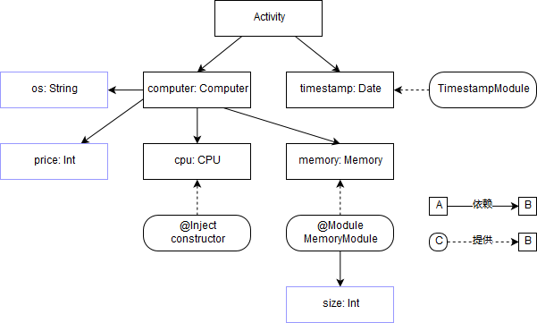
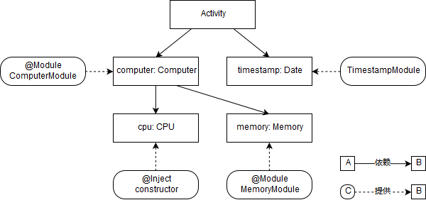

# 目标

上一篇说到我们想要dagger自动生成出类似于我们手写的`Bridge`桥接类，本文就是对实现此功能的`@Component`做一个简介分析，来看看dagger中怎样使用`@Component`吧

# 依赖图

在介绍本篇主角`@Component`之前，我们先根据已有代码画一个依赖图：（个人认为使用dagger就必须要弄清楚自己的依赖图，无论是画在纸上还是在脑海中，一定要想清楚再编写dagger）



如上图所示：

- 实线箭头表示依赖关系，虚线箭头表示提供数据，直角框表示对象，圆角框表示数据仓库
- 被`@Inject`注解的构造函数中的参数，也算做这个对象的依赖，比如`Computer`的`os`和`price`
- 和`@Inject`一样，被`@Provides`注解的方法中的参数也是一个依赖，不过这个依赖是被`@Module`注解的数据仓库的依赖，比如`provideMemory()`中的`size`

从上面依赖图中可以看到，**`os`、`price`、`size`这三个依赖是没有数据来源的**，回想下我们自己写的`Bridge`，这三个依赖其实都是我们手写（hardcode）传入工厂方法中的，如果想dagger帮我们生成这个`Bridge`，就要让dagger去调用工厂方法，那么怎样让dagger知道工厂方法中需要传入`Windos`、`6666`和`8192`这三个参数呢？这里有两个思路：

1. **为上述三个依赖都创建数据仓库**，比如`OsModule`、`PriceModule`、`SizeModule`。但`PriceModule`和`SizeModule`都是提供`Int`型数据，怎样让dagger知道`PriceModule`提供的`Int`实例是给`Computer`的`price`依赖，而`SizeModule`提供的`Int`实例是个`MemoryModule`的`size`依赖？怎样解决这种问题以后会说到，这里先留个悬念
2. 既然被`@Inject`注解的构造函数中的参数和被`@Provides`注解的方法中的参数都算依赖，那么我们直接**将构造函数和provide方法变成无参**的不就好了？比如在`Computer`的`init{}`中去给`os`和`price`赋值，或者将`size`作为`Module`的成员变量而不是provide方法的参数。前者修改`Computer`类很明显降低了类的灵活性，而且之前也说过`@Inject`无法用于三方库或系统中对象的构造函数，所以我们采取后者来解决提供依赖的问题

首先将`Computer`构造函数上的`@Inject`去掉，并为`Computer`新建数据仓库`ComputerModule`类，之后修改`MemoryModule`添加成员变量并使`@Provides`注解的方法变为无参：

```kotlin
@Module
class ComputerModule(private val os: String, private val price: Int) {
    @Provides
    fun provideComputer() = Computer(os, price)
}

@Module
class MemoryModule(private val size: Int) {
    @Provides
    fun provideMemory() = Memory(size)
}
```

编译一下，你会发现现在生成的工厂类，就和上一篇中无参的`@Provides`生成的工厂类一模一样了，这里可以思考下**为什么dagger生成的工厂类是对数据仓库（Module）的代理工厂**，而不是直接创建数据仓库实例，一切都是为了解耦提高灵活性（下面仅贴出`MemoryModule_ProvideMemoryFactory`作为对比，`ComputerModule_ProvideMemoryFactory`整体上大同小异就不再贴出来了）

```java
public final class MemoryModule_ProvideMemoryFactory implements Factory<Memory> {
  private final MemoryModule module;

  public MemoryModule_ProvideMemoryFactory(MemoryModule module) {
    this.module = module;
  }

  @Override
  public Memory get() {
    return provideMemory(module);
  }

  public static MemoryModule_ProvideMemoryFactory create(MemoryModule module) {
    return new MemoryModule_ProvideMemoryFactory(module);
  }

  public static Memory provideMemory(MemoryModule instance) {
    return Preconditions.checkNotNull(
        instance.provideMemory(), "Cannot return null from a non-@Nullable @Provides method");
  }
}
```

于是我们又可以修改一下我们的`Bridge`桥接类了：

```kotlin
/* CaseActivity.inject()方法 */
// 创建数据仓库
val computerModule = ComputerModule("Windows", 6666)
val memoryModule = MemoryModule(8192)
// 创建computer依赖
val computer = ComputerModule_ProvideComputerFactory.provideComputer(computerModule)
computer.cpu = CPU_Factory.newInstance()
computer.memory = MemoryModule_ProvideMemoryFactory.provideMemory(memoryModule)
// 使用注入器注入
CaseActivity_MembersInjector.injectComputer(target, computer)
```

# 使用@Component注解

经过上面一番折腾，我们再想想现在依赖图变成什么样了，是不是已经没有蓝色方框，所有依赖都有数据来源了？具象化一下现在的依赖图，如下：



此时此刻我们终于可以用上`@Component`注解了，这个注解是dagger中的注解，其可作用于接口或抽象类，通常我们都用于接口上，如下：

```kotlin
@Component(modules = [ComputerModule::class, TimestampModule::class]) // 在@Component的modules属性中，声明需要依赖的数据仓库
interface CaseActivityComponent { // 通常被@Component注解的接口名都以Component结尾
    fun inject(target: CaseActivity) // 通常会用inject方法表示将依赖注入到目标对象中，但应该知道其内部其实是桥接的实现
}
```

没错，就这样，编译一下我们发现又有新的类生成了——`DaggerCaseActivityComponent`，在分析其源码之前，我们先看看怎么使用它，修改`Activity`的`onCreate()`方法如下：

```kotlin
override fun onCreate(savedInstanceState: Bundle?) {
    super.onCreate(savedInstanceState)
    setContentView(R.layout.activity_case)

    //        CaseActivityBridge.inject(this) // 不再需要我们自己写的Bridge了
    DaggerCaseActivityComponent
    .builder()
    .computerModule(ComputerModule("Windows", 6666))
    //            .timestampModule(TimestampModule())
    .build()
    .inject(this)

    computer.cpu = CPU_Factory.newInstance()
    computer.memory = MemoryModule_ProvideMemoryFactory.provideMemory(MemoryModule(8192))

    show()
}
```

相信你看完上面代码后，会有下面这些疑问：

> Q：为什么`@Component.modules`中没有`MemoryModule`？`Computer`中不是有对`Memory`的依赖吗？
>
> A：我们仔细想想这个`Component`的定位，其是作为`Activity`与注入器的桥接类，但`Activity`中仅对`computer`和`timestamp`这两个依赖感兴趣（即`@Inject`注解的字段和方法），那么`Component`只要能够找到这些依赖的注入器或数据仓库就可以顺利完成桥接任务
>
> -------
>
> Q：在构建`DaggerCaseActivityComponent`这个桥接对象时，为什么需要显示调用`computerModule()`方法传入`Computer`的数据仓库，而无需显示调用`timestampModule()`方法传入`TimestampModule()`的数据仓库？
>
> A：这里其实是dagger的一个默认优化，如果`@Module`注解的数据仓库类有无参构造函数，在构建桥接对象时dagger会用无参构造函数去构造数据仓库；但对于需要传参的构造函数，因为dagger无法知道需要传参的具体值，所以需要使用者手动传入数据仓库。当然即使被`@Module`注解的数据仓库类有无参构造函数，如果有自己的特殊实现，当然可以调用`timestampModule()`方法传入此实现
>
> ---
>
> Q：如果说`Activity`通过依赖`ComputerModule`数据仓库和`ActivityComponent`桥接类实现了控制反转形式的依赖注入，那么对于`CPU`、`Memory`不还是`Activity`自己创建的实例？这样岂不是和最开始（第一篇没有使用依赖注入的时候）一模一样吗，无非就是使用了工厂类，反而代码更复杂了？
>
> A：这个问题需要我们思考为什么`Activity`需要创建`CPU`和`Memory`的实例？是不是因为这两个依赖在`Computer`中根本没有注入逻辑？所以上述写法反而变成了`Activity`作为注入器，将`Computer`的依赖`CPU`和`Memory`注入到`Computer`中去。那么这个对`Computer`的注入过程能不能让dagger帮我们实现呢？答案是肯定的，因为**`Computer`一方面作为`Activity`的依赖，另一方面也有着自己的依赖**

根据上面第三个Q&A，我们使用dagger对`Computer`的依赖实现注入：

```kotlin
// 就和Activity一样，需要一个对Computer和其依赖的一个桥接类ComputerComponent
@Component(modules = [MemoryModule::class])
interface ComputerComponent {
    fun inject(target: Computer)
}

// 将Computer中的依赖打上@Inject标签
class Computer(private val os: String, private val price: Int) {
    @set:Inject
    lateinit var cpu: CPU
    @set:Inject
    lateinit var memory: Memory
    /* ... */
}
```

闭着眼睛都能猜到上述代码编译后会生成`DaggerComputerComponent`类，于是我们再次改动`Computer`：

```kotlin
class Computer(private val os: String, private val price: Int) {
    /* ... */
    init { // 每次Computer实例初始化时，执行注入逻辑
        DaggerComputerComponent
            .builder()
            .memoryModule(MemoryModule(8192))
            .build()
            .inject(this)
    }
    /* ... */
}
// 最后别忘了将Activity中对computer注入的代码删掉，这里就不贴出来了
```

又到了提问环节：

>Q：`Computer`有依赖于`CPU`，但在`Component`中怎么没看到`CPU`相关的依赖说明？
>
>A：在`Component`中dagger对于`@Inject`注解的依赖（变量和方法）会先查找`Component`中有没有显示声明可以提供依赖数据的仓库（`@Module`中的`@Provides`），如果没有就会去依赖对象的类中查找有没有被`@Inject`注解的构造函数可用，如果还没有就会在编译时抛出一个`MissingBinding`的错误；然后再将`@Provides`注解的方法中或`@Inject`注解的构造函数中的参数作为依赖，和前面一样查找是否有数据仓库或构造函数可用。总之，**dagger会保证依赖图中所有的依赖都有数据来源（即`Factory`工厂）才能让`Component`编译通过**
>
>---
>
>Q：为什么这段`DaggerComputerComponent`代码不在`Activity`中而在`Computer`的`init{}`中？
>
>A：我们先想下现在代码变成什么样了，无论是从`Activity`还是从`ActivityComponent`的角度都不会知道`CPU`、`Memory`的存在了？是不是`Activity`只用关注其依赖的`computer`和`timestamp`，而`ActivityComponent`也只用关注这两个依赖而不会去关注这两个依赖还依赖其他什么东西了？这不就是解耦嘛（此处更应想起面向对象中**单一职责原则**）
>
>---
>
>Q：如果`Activity`也要控制`Memory`，那么是不是就应该在`Activity`中使用`DaggerComputerComponent`了？
>
>A：我们先分析一下业务逻辑，其实上一个Q&A所说`Activity`只依赖于`Computer`是不准确的，很明显`Activity`需要提供`ComputerModule`，因此需要指定`os`和`price`，这两个其实是`Computer`的依赖，但我们想想**`Activity`其实不一定要提供`ComputerModule`**，比如直接在`ComputerModule`中将参数写死（hardcode）或者交由其他类构建`DaggerCaseActivityComponent`；这里只是因为`Activity`对`Computer`的`os`和`price`这两个依赖感兴趣或者说需要`Activity`指明这两个参数。但即使`Activity`对`Memory`感兴趣，我觉得也不应该在`Activity`中使用`DaggerComputerComponent`（这**违反了最小知道原则**），修改的做法要么将`memory`改为`Computer`构造函数的入参，相应的还有修改`ComputerModule`，即不用dagger对`memory`依赖进行注入；或者由`Activity`提供`MemoryModule`给`computer`，而不是将`Activity`作为桥接类完成`Computer`的注入

# 源码分析

上面说了很多`@Component`的使用和思考，结合前几篇文章，我想大概能猜到生成的`DaggerComputerComponent`和`DaggerCaseActivityComponent`类中做了什么吧，下面就以`DaggerCaseActivityComponent`为例看看它的源码，主要关注其与我们之前自己写的`Bridge`有何不同：

```java
public final class DaggerCaseActivityComponent implements CaseActivityComponent {
  private final ComputerModule computerModule;

  private final TimestampModule timestampModule;

  private DaggerCaseActivityComponent(
      ComputerModule computerModuleParam, TimestampModule timestampModuleParam) {
    this.computerModule = computerModuleParam;
    this.timestampModule = timestampModuleParam;
  }

  public static Builder builder() {
    return new Builder();
  }

  @Override
  public void inject(CaseActivity target) {
    injectCaseActivity(target);
  }

  private CaseActivity injectCaseActivity(CaseActivity instance) {
    CaseActivity_MembersInjector.injectComputer(
        instance, ComputerModule_ProvideComputerFactory.provideComputer(computerModule));
    CaseActivity_MembersInjector.injectSetTimestamp(
        instance, TimestampModule_ProvideTimestampFactory.provideTimestamp(timestampModule));
    return instance;
  }

  public static final class Builder {
    private ComputerModule computerModule;

    private TimestampModule timestampModule;

    private Builder() {}

    public Builder computerModule(ComputerModule computerModule) {
      this.computerModule = Preconditions.checkNotNull(computerModule);
      return this;
    }

    public Builder timestampModule(TimestampModule timestampModule) {
      this.timestampModule = Preconditions.checkNotNull(timestampModule);
      return this;
    }

    public CaseActivityComponent build() {
      Preconditions.checkBuilderRequirement(computerModule, ComputerModule.class);
      if (timestampModule == null) {
        this.timestampModule = new TimestampModule();
      }
      return new DaggerCaseActivityComponent(computerModule, timestampModule);
    }
  }
}
```

总共的代码相对较多，我们耐下心来分析，无非就是两部分：

1. **Builder模式**构建此桥接类，我们知道Builder模式在构建复杂对象（或者说需要传入参数很多的对象）上非常好用，这里因为可能需要用到的`Module`有很多，有些dagger可以有默认构建，有些可能使用者会有自己的`Module`特殊实现，如此使用Builder模式封装，不仅使构建过程和依赖部件分离，还使得二者有更强的扩展性
2. 除去上述Builder模式外，也就只剩我们在接口中定义的`inject()`方法，和真正实现此方法的地方`injectCaseActivity()`方法了。仔细看其整体实现，其实与我们之前写的`Bridge`并无差别，依旧是三步走：**创建数据仓库、创建依赖对象、使用注入器注入**

综上，我们总算实现了本篇开头的目标：让dagger自动生成出类似于我们手写的`Bridge`桥接类

# 补充

1. 如果`@Component.module`都是dagger可以自动创建的（无参构造函数），可以使用`DaggerXxxComponent.create()`方法创建此桥接类（可以将`MemoryModule`的构造函数加上参数默认值试试，这里不再讲解）

2. 很多文章都会把`Component`称为注入器类，毕竟最终我们调用的是`inject()`方法，很直观也合乎情理；但通过之前的源码分析后，我更愿意将其看做桥接类，毕竟它不是真正执行**注入**这个操作的类，而是将`Component`、`Module`和注入目标类这几个维度结合起来的“一座桥”。我想这也是为什么官方称之为`Component`（组件）而不是`Injector`（注入器）的原因吧

3. 上面源码中没有贴出`DaggerComputerComponent`，因为其大体与`DaggerCaseActivityComponent`流程相同，不过这里有个小细节：`CPU`并不是通过`@Module`+`@Provides`提供的数据，而是通过`@Inject`注解构造函数提供的数据，查看其在`DaggerComputerComponent`中的桥接逻辑如下：

    ```java
    Computer_MembersInjector.injectSetCpu(instance, new CPU());
    ```

    很神奇这里没有用到`CPU_Factory`这个类，我猜这种操作一方面是为了减少函数调用次数，另一方面可能是为了兼容与规范性吧

# 总结

至此，终于陆陆续续介绍完了`@Inject`、`@Module`、`@Provides`、`@Component`这几个dagger框架中的关键注解了，回顾全部代码，我们会发现一个大问题：无论是`Activity`依赖的`computer`，还是`Computer`依赖的`cpu`和`memory`，我们都依赖了其具体类型，这**严重违反了面向对象中的依赖倒置原则**啊！那么应该怎样处理呢？接下来就是介绍`@Qualifier`的时候了