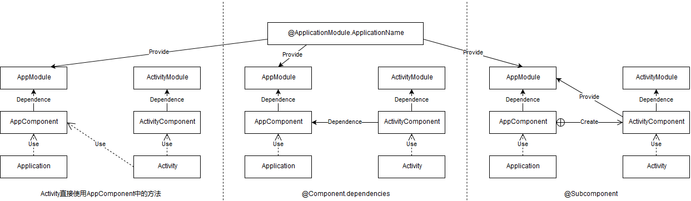

# 目的

通过前面几篇文章，我们了解到`@Module`代表着一个数据仓库，提供需要注入的依赖实例；而`@Component`代表着一个桥接类，桥接了被注入对象和其依赖的注入器/工厂类。打开这两个注解的源码，会发现原来还有新的世界等待着我们去探索：`@Module.includes`、`@Module.subcomponents`、`@Component.dependencies`，这些就是本系列压轴中要介绍的内容了

# @Module.includes

从此注解的名字就不难猜出它是干什么的了，这里我们假设蓝牙（`BlueTooth`）模块对于`Computer`来说也属于一种外设（`Device`）：

```kotlin
@Module(includes = [BlueToothModule::class]) // 表明DeviceModule数据仓库含有BlueToothModule数据仓库，也能够提供BlueTooth实例
class DeviceModule { /* ... */ }

@Component(modules = [/* ... */DeviceModule::class /*, BlueToothModule::class */]) // 在ComputerComponent中，就可以仅依赖DeviceModule而不必再声明对BlueToothModule的依赖了
interface ComputerComponent {
```

代码上看起来更直观了，**`@Module.includes`就是实现了`Module`的一种组合关系**

# @Component.dependencies

我们在`Activity`中会通过Toast显示应用名，当时是这样写的：

```kotlin
val name = (applicationContext as LearnDaggerApplication).component.getAppName()
```

`Component`作为桥接类，不仅能够提供注入的接口（`inject()`方法），还能直接提供依赖实例（比如上面的`getAppName()`），那么一个`Component`需要用到另一个`Component`提供的依赖，就可以用`@Component.dependencies`：

```kotlin
// 没有改动ApplicationComponent，这里只是贴出来示例
@ApplicationScope
@Component(modules = [ApplicationModule::class])
interface ApplicationComponent {
    @ApplicationModule.ApplicationName fun getAppName(): String
}

@MonitorScope
@Component(
    modules = [ComputerModule::class, TimestampModule::class, MonitorModule::class, AMDCPUModule::class],
    dependencies = [ApplicationComponent::class] // 添加Component依赖
)
interface CaseActivityComponent {
    /* ... */
    @ApplicationModule.ApplicationName fun getAppName(): String // 添加了Component依赖后，这个Component也有提供应用名这个依赖的能力了

    @Component.Builder
    interface Builder {
        /* ... */
        fun applicationComponent(component: ApplicationComponent): Builder // 别忘了自定义Builder需要为每一个dependencies提供方法
    }
}

// 最后修改一下Activity中的使用逻辑
override fun onCreate(savedInstanceState: Bundle?) {
    /* ... */
    component = DaggerCaseActivityComponent
    .builder()
    .computerModule(ComputerModule(6666, 8888))
    .monitorModule(MonitorModule(this, text_view))
    .applicationComponent((applicationContext as LearnDaggerApplication).component) // 需要依赖另一个Component
    .build()
    component.inject(this)
    /* ... */
    Toast.makeText(this, component.getAppName(), Toast.LENGTH_SHORT).show() // Toast显示应用名
}
```

理解起来应该也没多大困难，只是要注意一般**A依赖B，那么B的生命周期是大于等于A的生命周期**（结合上面例子即：`ApplicationComponent`的生命周期 ≥ `ActivityComponent`的生命周期），如果反过来（即`ApplicationComponent`依赖`ActivityComponent`）则很容易造成内存泄漏问题。所以对于`@Component`上的`@Scope`，也需要注意生命周期的问题，即`@ApplicationScope`的生命周期需要大于`@MonitorScope`的生命周期。另外因为我们使用了`@Scope`，所以对于应用名这个`String`来说，其是一个单例（因为其生命周期与`Application`绑定，我们也认为其是一个全局单例）

# @Subcomponent & @Module.subcomponents

## 使用

很多文章都将`@Subcomponent`看做是继承关系，但我个人觉得其更像是**内部类形式的组合关系**，我们还是以`ApplicationComponent`和`ActivityComponent`为例，先看下使用方式：

```kotlin
// 修改CaseActivityComponent，注意这里将@Component改为了@Subcomponent
@MonitorScope
@Subcomponent(modules = [ComputerModule::class, TimestampModule::class, MonitorModule::class, AMDCPUModule::class])
interface CaseActivityComponent {
    @ApplicationModule.ApplicationName fun getAppName(): String // 注意这里代表此Component有提供应用名的能力，但@Subcomponent.modules中其实并没有能提供应用名的数据仓库
    /* ... */
    @Subcomponent.Builder // 注意这里需要改为@Subcomponent
    interface Builder {
        /* ... */
        //        fun applicationComponent(component: ApplicationComponent): Builder // 不再需要提供applicationComponent的set方法
    }
}

// ApplicationModule声明subcomponents
@Module(subcomponents = [CaseActivityComponent::class])
class ApplicationModule(private val appName: String) { /* ... */ }

@ApplicationScope
@Component(modules = [ApplicationModule::class])
interface ApplicationComponent {
    @ApplicationModule.ApplicationName fun getAppName(): String
    fun caseActivityComponentBuilder(): CaseActivityComponent.Builder // 使用了ApplicationModule的ApplicationComponent就有了提供ActivityComponent.Builder实例的能力
}

/* CaseActivity.onCreate()方法 */
override fun onCreate(savedInstanceState: Bundle?) {
    component = (applicationContext as LearnDaggerApplication)
        .component
        .caseActivityComponentBuilder() // 注意这里是通过ApplicationComponent拿到ActivityComponent.Builder的
        .computerModule(ComputerModule(6666, 8888))
        .monitorModule(MonitorModule(this, text_view))
        .build()
    /* ... */
    Toast.makeText(this, component.getAppName(), Toast.LENGTH_SHORT).show() // 此时SubComponent有提供应用名的能力
}
```

- 可以看到对于`Component`的修改不大，需要注意`@Subcomponent`是没有`dependencies`属性的，也就是说二者不能混用
- 为何是在`@Module`而不是在`@Component`中声明`subcomponents`我一开始也不是很理解，但仔细想想`@Module`是一个可以提供各种数据的数据仓库，而`@Component`不过是一个桥接类，其桥接的数据实例一定是`@Component.modules`可以提供的数据类型，那么这里不妨将**被`@Subcomponent`注解的类或其`@Subcomponent.Builder`注解的Builder类作为一种数据**，通过`@Module.subcomponents`属性表示该`Module`可以提供这种数据，从而使用此`Module`的`@Component`才能够桥接这种数据的实例

## 源码分析

编译之后你会发现并没有生成我们熟悉的`DaggerCaseActivityComponent`类，因为现在**单独看被`@Subcomponent`注解的`CaseActivityComponent`，它的依赖树并不完整**（没有数据仓库提供别名为`@ApplicationModule.ApplicationName`的`String`类型数据），取而代之的，是在`DaggerApplicationComponent`中有了新的内部类`CaseActivityComponentImpl`，我们看下源码：

```java
public final class DaggerApplicationComponent implements ApplicationComponent {
  private Provider<String> provideAppNameProvider;
  /* ... */
  @SuppressWarnings("unchecked")
  private void initialize(final ApplicationModule applicationModuleParam) {
    this.provideAppNameProvider =
        DoubleCheck.provider( // DoubleCheck.provider以实现应用名单例
            ApplicationModule_ProvideAppNameFactory.create(applicationModuleParam));
  }

  @Override
  public String getAppName() { // 每次获取的都是同一个实例
    return provideAppNameProvider.get();
  }

  @Override
  public CaseActivityComponent.Builder caseActivityComponentBuilder() {
    return new CaseActivityComponentBuilder();
  }
  /* ... */
  private final class CaseActivityComponentBuilder implements CaseActivityComponent.Builder { // CaseActivityComponent.Builder也成了其内部类
    /* ... */
    @Override
    public CaseActivityComponent build() {
	 /* ... */
      return new CaseActivityComponentImpl(computerModule, new TimestampModule(), monitorModule);
    }
  }

  private final class CaseActivityComponentImpl implements CaseActivityComponent { // 和之前的DaggerCaseActivityComponent差别不大
    /* ... */
    @Override
    public String getAppName() { // 特别注意这个方法，其用的是外部类的东西
      return DaggerApplicationComponent.this.provideAppNameProvider.get();
    }
    /* ... */
  }
}
```

其整体上基本上就是把之前的`DaggerCaseActivityComponent`中的代码搬过来了，特别注意的是`CaseActivityComponentImpl.getAppName()`这个方法，其使用的是外部类的`Provider`，这也是为什么我将`@Subcomponents`看做是内部类的组合关系而不是继承关系的原因

## 其他补充

### 使用抽象工厂方法构建@Subcomponent

dagger提供了另一种方法，可以通过`@Component`直接构建`@Subcomponent`而不是其`Builder`：

```kotlin
@ApplicationScope
@Component(modules = [ApplicationModule::class])
interface ApplicationComponent {
    @ApplicationModule.ApplicationName fun getAppName(): String
    fun caseActivityComponent(
        computerModule: ComputerModule,
        monitorModule: MonitorModule
    ): CaseActivityComponent // 这里直接返回CaseActivityComponent实例，而不是CaseActivityComponent.Builder
}
```

这种写法就没必要声明`@Module.subcomponents`以及`@Subcomponents.Builder`了（`@Subcomponent`还是要的），并且需要将所有dagger不能自动构建出的`Module`（即没有无参构造函数的`Module`）都作为参数写到这个抽象工厂方法中（这里估计和`@Subcomponent.Factory`有关）。不过**更推荐使用`@Module.subcomponents`声明这种内部类组合关系**，一方面dagger可以更好地检测出是否真的需要`Subcomponnent`，另一方面这种更加明显的表示内部类组合关系

### 与Multibings结合

在以前的文章中我们介绍了使用`@IntoSet`或`@IntoMap`注入`Set`或`Map`，而对于`@Subcomponent`，如果`@Component`也有相同的注入，这些注入内容将会被合并。这里我们将`ComputerComponent`也改造成`@Subcomponent`：

```kotlin
// 修改ComputerComponent为@Subcomponent
@Subcomponent(/* ... */)
interface ComputerComponent {
    /* ... */
    @Subcomponent.Builder // 别忘了Builder也要改为@Subcomponent的
    interface Builder { /* ... */ }
}

// 在ApplicationModule上添加Subcomponent的声明
@Module(subcomponents = [CaseActivityComponent::class, ComputerComponent::class])
class ApplicationModule(private val appName: String) { /* ... */ }

class LearnDaggerApplication : Application() {
    /* ... */
    override fun onCreate() {
        /* ... */
        application = this
    }
    companion object { lateinit var application: LearnDaggerApplication } // 方便Computer获得Application实例
}

// Computer.init{}块
abstract class Computer(private val os: String, private val price: Int) {
	/* ... */
	// 这两个是需要被注入的Set和Map容器
    @set:Inject lateinit var disks: Set<Disk>
    @set:Inject lateinit var devices: Map<String, @JvmSuppressWildcards Device>
	/* ... */
    init {
        @Suppress("LeakingThis")
        LearnDaggerApplication
            .application
            .component
            .computerComponentBuilder() // 注意这里使用Application的component获取ComputerComponent.Builder
            .blueToothVersion("2.3")
            .build()
            .inject(this)
    }
}
```

上面都是使用`@Subcomponent`的基础操作，接下来我们试着在`ApplicationModule`中添加一些`@IntoSet`和`@IntoMap`：

```kotlin
@Module(subcomponents = [CaseActivityComponent::class, ComputerComponent::class])
class ApplicationModule(private val appName: String) {
	/* ... */
    @[Provides IntoSet]
    fun provideHugeSSD() = Disk(Disk.Type.SSD, Disk.Capacity.HUGE) // 添加一个1024G的SSD

    @[Provides IntoMap StringKey("Spare Sound")] // 再添加一个备用音响
    fun provideSound(): Device = Sound()
}
```

运行起来后你会发现上面两个对象被注入到`Computer.disks`和`Computer.devices`中了，**这种特性有其便捷性**（为每一个`@Subcomponent`的`Set`或`Map`提供默认注入内容），但**也容易变成一个巨坑**，使用时还请留意此特性

### 结合@Scope

`@Subcomponent`与`@Component.dependencies`一样，它们被注解的`@Scope`所表示的生命周期都应该有一个包含关系，即短生命周期对象依赖于长生命周期对象，而不是反过来

# 区别与补充

## 区别

无论是使用`@Component.dependencies`还是`@Subcomponent`或是本篇文章之前的直接调用`ApplicationComponent`，我们例子中的目的无非都是**复用长生命周期的依赖或数据仓库**（例子中的应用名），下面先看一下区别图：



先说中间通过`@Component.dependencies`建立依赖关系，这里是`ActivityComponent`对`AppComponent`的依赖，因此**仅依赖`AppComponent`对外暴露出的数据接口**，比如我将`TimestampModule`写在`ApplicationComponent`依赖的`Module`中，而将其从`ActivityComponent`中去掉，并使用`@Component.dependencies`建立依赖关系，如下：

```kotlin
@Component(modules = [ApplicationModule::class, TimestampModule::class])
interface ApplicationComponent { /* ... */ }
```

只有当`ApplicationComponent`中有一个返回`Date`类型的方法（意味着`ApplicationComponent`愿意对外暴露提供这种数据的接口），才可以编译通过

而对于图右边的`@Subcomponent`则没有这个问题，因为其是一个**类似内部类组合关系**，类比内部类可以调用到外部类的方法、属性，哪怕是`private`的，就像`@Subcomponent`能够使用`@Component`中的所有数据依赖，哪怕是没有对外公开接口的

最后直接在`Activity`中使用`AppComponent`则是最不推荐的，它**破坏了dagger架构的封装性**，哪怕这是最简单且行之有效的方法

## 补充

**无论是`@Component.dependencies`还是`@Subcomponent`，它们对`@Module`的依赖都不能重复**，即对于某一种数据只能对应一个来源，如果有多个来源肯定是需要`@Qualifier`定义别名以区分的，否则就会有`DuplicateBindings`的问题

**最后强调一下：我一直将`@Subcomponent`比作类似内部类组合关系，但这里的外部类（`@Component`）是不能够使用内部类（`@Subcomponent`）中的未暴露方法的，很多人将`@Subcomponent`比作继承关系我想更多地是因为子类可以调用父类方法，而父类不知道子类方法的逻辑吧，如果类比成这种继承关系，那么将父类中的数据（`@Component.modules`）看做`protected`限制修饰符也许更容易理解**

# 总结

至此，终于介绍完了dagger框架中所有的内容，之前对`javax.inject`已经有过一次小总结了，这里就只对`dagger`中相关内容进行一个简单总结：

```plain
dagger // dagger包下大多是核心注解
├── Binds.class // 注解@Module中的抽象方法，主要场景是@Inject注解构造函数+有继承关系的对象上
├── BindsInstance.class // 注解@Component.Builder中的方法，用于绑定某个实例以提供数据依赖
├── BindsOptionalOf.class // 需要结合JDK 1.8中的Optional类使用，用于某个对象可空的情景上，在kotlin中实在鸡肋
├── Component$Builder.class // 用于自定义Component的Builder对象
├── Component.class // dagger核心注解之一，用于定义一个桥接类，其中有modules和dependencies两个属性，分别指定依赖的数据仓库 和 依赖的其他桥接类
├── Component$Factory.class // 与Component$Builder作用一样，dagger2.22引入，目前不常用
├── internal // internal包中是一些辅助类，常用于dagger生成的代码中（此包中的内容有所省略，挑重点总结）
│   ├── DoubleCheck.class // 提供了provider()和lazy()两个静态方法，分别用于实现局部单例和dagger.Lazy懒加载数据上
│   ├── MapBuilder.class // 用于辅助@IntoMap等构建Map容器，最终生成的是一个不可修改的Map容器
│   ├── SetBuilder.class // 用于辅助@IntoSet等构建Set容器，最终生成的是一个不可修改的Set容器
├── Lazy.class // dagger.Lazy对象，用于dagger注入懒加载对象
├── MapKey.class // 用于辅助Map注入的自定义Key的注解
├── MembersInjector.class // 注入器的接口
├── Module.class // dagger核心注解之一，用于定义一个数据仓库，其中有includes和subcomponents两个属性，分别指定对其他数据仓库的简单组合 和 对@Subcomponent桥接类的依赖
├── multibindings // multibindings包下是一些有关与dagger的multibing特性的东西
│   ├── ClassKey.class // 用于辅助@IntoMap，指定Map容器的Key类型
│   ├── ElementsIntoSet.class // 用于辅助Set注入，可以将一个已有的Set注入到最终的Set中
│   ├── IntKey.class // 用于辅助@IntoMap，指定Map容器的Key类型
│   ├── IntoMap.class // 用于辅助@IntoMap，指定Map容器的Key类型
│   ├── IntoSet.class // 用于辅助@IntoMap，指定Map容器的Key类型
│   ├── LongKey.class // 用于辅助@IntoMap，指定Map容器的Key类型
│   ├── Multibinds.class // 用于辅助Set和Map注入，适用在编译器不确定是否有注入元素时，使得可以注入空容器
│   └── StringKey.class // 用于辅助@IntoMap，指定Map容器的Key类型
├── Provides.class // dagger核心注解之一，注解@Module中的方法表示此方法可以提供某种类型的数据
├── Reusable.class // dagger中对@Scope的一个特殊实现，目前处于测试阶段，相较于普通的@Scope，@Reusable不用在@Component上再次声明作用域
├── Subcomponent$Builder.class // 用于自定义Subcomponent的Builder对象
├── Subcomponent.class // 用于自定义一个桥接类，此桥接类不能单独使用也不会被dagger单独生成对应Daggerxxx类，需要配合@Module.subcomponent使用
└── Subcomponent$Factory.class // 与Subcomponent$Builder作用一致
```

> “压轴”本意是指倒数第二个节目

没错，本系列还有最后一篇，将会介绍dagger在android中的特殊使用——`dagger.android`扩展库

