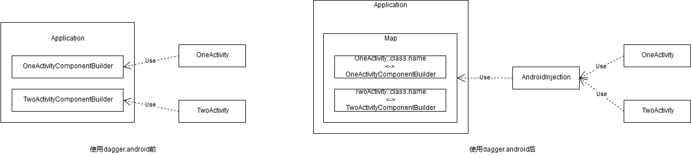

# 回顾

我们回顾一下目前为止的代码，我们通过`ApplicationModule`数据仓库，提供应用名数据，而`Activity`和`Computer`为了拿到这个数据，是通过定义`@Subcomponent`，使其与`ApplicationComponent`称为类似内部类组合的关系，从而可以使用到`ApplicationModule`中的内容。在Android系统中，`Activity`、`Fragment`都是由系统创建的，我们无法通过dagger管理其构造函数而仅能将注入语句插入到其生命周期中，并且每多出一个`Activity`，我们都要在`ApplicationComponent`中针对性的添加一个返回`Subcomponent.Builder`的方法，最严重的是，**`Activity`在使用时需要知道使用的`Component`的具体类型，这违反了被注入类不应该知道注入细节这个原则**

# Sample需求

之前用的显示`Computer`信息那个项目太混乱了，我们这里重新创建一个应用模块，目前的需求如下：

- 该应用总共有两个主要`Activity`（`OneActivity`与`TwoActivity`），我们需要指定其*标题*、*背景色*和一段*文本内容*
- 这两个`Activity`有其各自的标题，但背景色需要统一，文本内容对应着一个全局单例的`data`类

就这两点需求，我们使用dagger来注入这些内容，其中统一的数据由`ApplicationModule`提供，而各自的数据由各自的`Module`提供：

# 使用dagger.android前的代码

我们先编写`data`类和那些`@Module`：

```kotlin
// data类相当简单，其内部由一个String和一个Int数据组成
data class VirtualData(private val name: String, private val num: Int)

// ActivityModule仅提供各自Activity自己的数据
@Module
class OneActivityModule {
    @Qualifier annotation class Title // 对于基本类型、String和一些共享性较强的数据类型，通常习惯定义别名，以免造成冲突以及增加语义性
    @[Provides Title] fun provideTitle() = "One Activity"
}

@Module
class TwoActivityModule {
    @Qualifier annotation class Title
    @[Provides Title] fun provideTitle() = "Two Activity"
}

// ApplicationModule中提供统一数据
@Module
class ApplicationModule {
    @Qualifier annotation class ActivityColor
    @[Provides ColorInt] fun provideActivityColor(@[ActivityColor ColorInt] color: Int) = color // @ColorInt是androidx中的注解，与dagger无关，这里仅为增强语义

    @Qualifier annotation class ActivityData
    @[Provides Singleton ActivityData] fun provideActivityData() = VirtualData(Date().toString(), Random.nextInt()) // Application生命周期即应用声明周期，就直接使用了@Singletion注解；为了证明其单例，data类中使用的为随机数据
}
```

通过`@Module`我们准备好了数据仓库，接下来我们通过`@Inject`在`Activity`中将需要注入的数据打上标记：

```kotlin
class OneActivity : AppCompatActivity() {
    @filed:[Inject OneActivityModule.Title] lateinit var title: String
    
    // kotlin对于基本数据类型的成员变量，其默认都是使用private+get/set方法，这里就必须使用set和setparam指定注解目标了（其实也可以使用@JvmField注解，不过会丢失get/set方法）
    @set:Inject
    @setparam:ApplicationModule.ActivityColor
    var color: Int = 0 // kotlin中的基本数据类型是不能用lateinit关键字的，使用字面量指定初始值时需要注意数据合法性
    
    @filed:[Inject ApplicationModule.ActivityData] lateinit var data: VirtualData
    /* ... */
}
// TwoActivity类似，这里就不贴出来了
```

编译后，通过`@Inject`我们得到了注入器（`MembersInjector`），接下来就是编写各种`@Component`桥接类，将数据与注入器结合起来了：

```kotlin
@Subcomponent(modules = [OneActivityModule::class]) // Activity所需的数据并不能通过此Component建立完整依赖关系，所以使用@Subcomponent等待父Component辅助使其依赖完整
interface OneActivityComponent {
    fun inject(target: OneActivity)

    @Subcomponent.Builder // 使用@Subcomponent必须要将自定义Component构造器 
    interface Builder {
        fun build(): OneActivityComponent
    }
}
// TwoActivityComponent类似，这里就不贴出来了

// 别忘了将两个子Component加入到父Component的module依赖的subcomponents中，以便父Component能够访问到子Component的Builder构造器，以及让子Component能够共享父Component的Module依赖
@Module(subcomponents = [OneActivityComponent::class, TwoActivityComponent::class])
class ApplicationModule { /* ... */ }

// ApplicationComponent主要提供ActivityComponent.Builder构造器，另外还需要将Module中的依赖补充完整
@Singleton // 别忘了ApplicationModule中的数据需要@Singleton作用域
@Component(modules = [ApplicationModule::class])
interface ApplicationComponent {
    fun newOneActivityComponentBuilder(): OneActivityComponent.Builder
    fun newTwoActivityComponentBuilder(): TwoActivityComponent.Builder

    @Component.Builder
    interface Builder {
        @BindsInstance // 使用@BindsInstance使得ApplicationModule中的@ActivityColor依赖完整
        fun activityColor(@[ApplicationModule.ActivityColor ColorInt] color: Int): Builder
        
        fun build(): ApplicationComponent
    }
}
```

编译通过后我们就可以尽情的使用dagger帮我们生成的`Component`类了：

```kotlin
// Application中准备好ApplicationComponent，以便Activity可以访问到
class Case11Application : Application() {
    private lateinit var _component: ApplicationComponent
    val component get() = _component

    override fun onCreate() {
        super.onCreate()

        _component = DaggerApplicationComponent
            .builder()
            .activityColor(Color.CYAN)
            .build()
    }
}

// Activity中通过访问Application拿到自己的Component.Builder
class OneActivity : AppCompatActivity() {
    /* ... */
    override fun onCreate(savedInstanceState: Bundle?) {
        super.onCreate(savedInstanceState)
        setContentView(R.layout.activity_one)

        (application as Case11Application)
            .component
            .newOneActivityComponentBuilder()
            .build()
            .inject(this)

        setTitle(title)
        container.setBackgroundColor(color)
        content.text = data.toString()
    }
}
```

运行一下，代码逻辑完全没有问题，该是单例的就是单例，两个页面的标题也不同。虽然目的是达到了，但我们假设下如果随着需求的增多，**有几十上百个这样的`Activity`时会怎样**？

- 我们不得不将每一个`Activity`对应的`Subomponent.Builder`和`ApplicationComponent`中
- 每一个`Activity`都需要重复那么一长段代码，随着项目的迭代和新人的接手，这段代码将变得容易出错且难以理解
- 每个`Activity`都需要知道自己要调用什么样的方法才能得到自己的`Component`（比如上面的`newOneActivityComponentBuilder()`方法），但**被注入对象不应该知道任何被注入的细节**（最少知道原则）

为了解决这种冗余和重复代码，通常解决途径都是**抽象和统一管理**，于是乎`dagger.android`扩展库就由此产生了

# 使用dagger.android重构代码

官方将`dagger.android`的使用过程分成5步

## 第0步：引入扩展库

```groovy
implementation 'com.google.dagger:dagger-android:2.22.1'
implementation 'com.google.dagger:dagger-android-support:2.22.1' // 适用于使用了support包的应用
kapt 'com.google.dagger:dagger-android-processor:2.22.1' // 别忘了kotlin中使用的是kapt
```

## 第一步：添加AndroidInjectionModule

`AndroidInjectionModule`是`dagger.android`框架提供的`Module`，官方要求我们将其添加到`ApplicationComponent`中：

```kotlin
@Singleton
@Component(modules = [ApplicationModule::class, AndroidInjectionModule::class])
interface ApplicationComponent { /* ... */ }
```

## 第二步：编写Subcomponent

也就是我们之前写的`ActivityComponent`，不过`dagger.android`要求其继承`AndroidInjector`接口，并且其内部需要有一个继承了`AndroidInjector.Factory`的`@Subcomponent.Factory`接口：

```kotlin
@Subcomponent(modules = [OneActivityModule::class])
interface OneActivityComponent: AndroidInjector<OneActivity> {
    @Subcomponent.Factory 
    interface Factory: AndroidInjector.Factory<OneActivity>
}
// TwoActivityComponent修改类似，不再贴出代码
```

这里对比之前有几点注意：

- `AndroidInjector`和`AndroidInjector.Factory`都需要指定泛型，类型为`Component`对应的被注入对象
- 无需在`@Subcomponent`接口中写`inject()`方法了
- `Factory`与`Builder`不能混用，因此这里删去`@Subcomponent.Builder`
- `Factory`中也不需要（且不能够）定义其他方法了

## 第三步：在Module中添加Subcomponent

这一步不仅要在`ApplicationModule`的`@Module.subcomponents`中添加上一步的`@Subcomponent`，还需要添加一个较为复杂的抽象方法；之前文章说过**`@Module`中不能同时有抽象方法和非静态方法**，所以这里我专门为这种`@Subcomponent`新建一个抽象`@Module`，并引入到`ApplicationComponent`中：

```kotlin
// 将Subcomponents转移到新的抽象Module上
@Module
class ApplicationModule { /* ... */ }

@Module(subcomponents = [OneActivityComponent::class, TwoActivityComponent::class])
abstract class ActivityFactoryModule {
    @[Binds IntoMap ClassKey(OneActivity::class)] // @Binds是一种用于决定抽象类型的依赖具体实现类型的方案，可以看下之前的文章有介绍到
    abstract fun bindOneActivityInjectorFactory(
        factory: OneActivityComponent.Factory
    ): AndroidInjector.Factory<*>

    @[Binds IntoMap ClassKey(TwoActivity::class)]
    abstract fun bindTwoActivityInjectorFactory(
        factory: TwoActivityComponent.Factory
    ): AndroidInjector.Factory<*>
}

// 在ApplicationComponent中引入上面新的抽象Module
@Singleton
@Component(modules = [ApplicationModule::class, AndroidInjectionModule::class, ActivityFactoryModule::class])
interface ApplicationComponent {
    // 这两个方法不再需要
//    fun newOneActivityComponentBuilder(): OneActivityComponent.Builder
//    fun newTwoActivityComponentBuilder(): TwoActivityComponent.Builder
	fun inject(target: Case11Application) // 我们需要对Application注入一些依赖
	/* ... */ 
}
```

## 第四步：使Application实现HasActivityInjector接口

```kotlin
class Case11Application : Application(), HasActivityInjector {
    @field:Inject
    lateinit var activityInjectorDispatcher: DispatchingAndroidInjector<Activity> // 新增dagger注入对象

    // 不再需要这个属性
//    private lateinit var _component: ApplicationComponent
//    val component get() = _component

    override fun onCreate() {
        super.onCreate()

        DaggerApplicationComponent
            .builder()
            .activityColor(Color.CYAN)
            .build()
        	.inject(this) // 需要注入
    }

    override fun activityInjector(): AndroidInjector<Activity> = activityInjectorDispatcher // HasActivityInjector接口要求实现的方法
}
```

## 第五步：在Activity中调用注入逻辑

```kotlin
// Activity.onCreate()方法
override fun onCreate(savedInstanceState: Bundle?) {
    /* ... */
    //        (application as Case11Application)
    //            .component
    //            .newTwoActivityComponentBuilder()
    //            .build()
    //            .inject(this)
    AndroidInjection.inject(this)
    /* ... */
}
```

没错非常精简且经典的一个方法

我们先不慌分析其实现源码，从修改结果上，我们看下解决了什么问题，有带来了什么问题：

- 不必再将`@Subcomponent.Builder`写入`ApplicationComponent`中了，取而代之的，我们需要以一种特定的方式将`@Subcomponent.Factory`写入`ApplicationComponent`依赖的`@Module`中（似乎更复杂了？）
- `Activity`中不必再重复那样的模板代码，无论在哪个`Activity`中都是相同的一句`AndroidInjection.inject(this)`
- 对于`@Subcomponent`和`@Component`的改动都是向着简化的方面进行

整体上来说代码确实简化了不少，最重要的是，**`Activity`不再需要知道注入细节了**！接下来就看看其源码实现怎样的

# 源码分析

我相信大部分人看到上面用到的`dagger.android`中的类名、接口名、`@IntoMap`等就能猜到个大概了，大致就是通过`Map`容器收集各`Component.Factory`，通过`AndroidInjection`访问到这个`Map`容器，之后进行`Factory`的派发与注入，从而实现`Activity`与`Component`桥接类的构建器解耦；同时通过接口和抽象类规范化使用流程，顺便起到简化编码的作用

下面我们从第一步开始慢慢分析

## AndroidInjectionModule

最开始我们将`AndroidInjectionModule`写到`ApplicationComponent`的`modules`依赖中，其源码如下：

```java
@Module
public abstract class AndroidInjectionModule {
  @Multibinds abstract Map<Class<?>, AndroidInjector.Factory<?>> classKeyedInjectorFactories();
  @Multibinds abstract Map<String, AndroidInjector.Factory<?>> stringKeyedInjectorFactories();
  private AndroidInjectionModule() {}
}
```

这是一个抽象`@Module`，其用`@Multibinds`提供了两种类型的`Map`数据，之前文章说过`@Multibinds`是为了解决在编码时不能确定容器内是否有元素被注入的问题，即为了依赖完整性可以提供大小为0的容器（不熟悉的可以翻下前面文章看下）

> Q1：这两种类型的`Map`容器在哪里被使用到呢？

## AndroidInjector & AndroidInjector.Factory

第二步中，我们修改了`@Subcomponent`注解的接口，使其继承自`AndroidInjector`，并且其内部的`@Subcomponent.Factory`注解的接口也需要继承自`AndroidInjector.Factory`，看下这两个的源码：

```java
public interface AndroidInjector<T> {
  void inject(T instance);
  
  interface Factory<T> {
    AndroidInjector<T> create(@BindsInstance T instance);
  }

  @Deprecated // 在Factory出现前都是用的Builder，不过现在已经被弃用了
  abstract class Builder<T> implements AndroidInjector.Factory<T> {
    /* ... */
  }
}
```

难怪我们不用再在`@Subcomponent`中手写`inject()`方法，并且`@Subcomponent.Factory`中必须有的唯一一个方法，也被这个接口规范化了

> Q2：虽然这样规范化大幅度简化了开发者的编码，但当我们需要自定义Builder对象时怎么办呢？（比如需要使用上`@BindsInstance`）

## @Binds + @IntoMap + @ClassKey

在第三步中我们在新建的抽象`@Module`中用到了这三个注解，这三个注解也在之前文章都有介绍过。在`dagger.android`中将三者结合使用，不得不说学到了新姿势。我们重新看下我们编写的代码：

```kotlin
@[Binds IntoMap ClassKey(OneActivity::class)]
abstract fun bindOneActivityInjectorFactory(
    factory: OneActivityComponent.Factory
): AndroidInjector.Factory<*>
```

`@Binds`用于注入抽象类时指明具体的实现类；`@IntoMap`和`@ClassKey`用于指明`Map`容器注入，并且是`Map<Class<*>, AndroidInjector.Factory<*>>`这样的容器。这个容器是不是很熟悉？没错，就是`AndroidInjectionModule`中定义的`Map`容器，但其中还定义了一个`Map<String, AndroidInjector.Factory<*>>`容器，由此可得出上面的`@ClassKey`可以换成`@StringKey`

> Q3：如果将`@ClassKey`换成`@StringKey`，应该怎样写？（自定义一个`String`吗？）

在第三步中我们还去掉了`ApplicationComponent`中`fun newOneActivityComponentBuilder(): OneActivityComponent.Builder`这样的代码，并不是说不需要`@Subcomponent.Builder`了，而是`dagger.android`将其注入到了上面的`Map`容器中去了

## HasActivityInjector

第四步中我们让`Application`实现了`HasActivityInjector`接口，其定义如下：

```java
public interface HasActivityInjector {
  AndroidInjector<Activity> activityInjector();
}
```

接口虽然简单，但问题变得更多了

> Q4：`HasActivityInjector`有什么作用？为什么其要定义一个返回`AndroidInjector<Activity>`的方法？

## DispatchingAndroidInjector

同样在第四步中，我们还在`Application`添加了如下代码：

```kotlin
@field:Inject 
lateinit var activityInjectorDispatcher: DispatchingAndroidInjector<Activity>
```

在变量上添加了`@Inject`代表这个变量是要需要被注入的，但我们在`ApplicationComponent`所依赖的`modules`中并没有看到提供这种数据的方法，怎么回事？赶快点开源码看看：

```java
public final class DispatchingAndroidInjector<T> implements AndroidInjector<T> {
  /* ... */
  private final Map<String, Provider<AndroidInjector.Factory<?>>> injectorFactories; // 两个map合并后的map

  @Inject
  DispatchingAndroidInjector(
      Map<Class<?>, Provider<AndroidInjector.Factory<?>>> injectorFactoriesWithClassKeys,
      Map<String, Provider<AndroidInjector.Factory<?>>> injectorFactoriesWithStringKeys) {
    this.injectorFactories = merge(injectorFactoriesWithClassKeys, injectorFactoriesWithStringKeys);
  }
  
  private static <C, V> Map<String, Provider<AndroidInjector.Factory<?>>> merge(
      Map<Class<? extends C>, V> classKeyedMap, Map<String, V> stringKeyedMap) { /* 合并两个map，非重要部分 */ }

  @CanIgnoreReturnValue
  public boolean maybeInject(T instance) {
    Provider<AndroidInjector.Factory<?>> factoryProvider =
        injectorFactories.get(instance.getClass().getName()); // 寻找真正的AndroidInjector
    if (factoryProvider == null) {
      return false;
    }

    @SuppressWarnings("unchecked")
    AndroidInjector.Factory<T> factory = (AndroidInjector.Factory<T>) factoryProvider.get();
    try {
      AndroidInjector<T> injector =
          checkNotNull(factory.create(instance), "%s.create(I) should not return null.", factory.getClass());

      injector.inject(instance);
      return true;
    } catch (ClassCastException e) { /* 抛出异常，非重要部分 */ }
  }

  @Override
  public void inject(T instance) {
    boolean wasInjected = maybeInject(instance);
    if (!wasInjected) { /* 注入失败抛异常，非重要部分 */ }
  }
  /* 异常与报错等，非重要部分 */
}
```

首先我们注意`DispatchingAndroidInjector`的构造函数上有`@Inject`，说明dagger可以通过此构造函数提供对象，所以不用写到`@Module`内；`@Inject`注解的构造函数中的参数也是被看做为依赖，刚好与`AndroidInjectionModule`中`@Multibinds`定义的两个`Map`容器类型相同（注意这里用了dagger的`Provider`封装了`AndroidInjector.Factory<?>`，dagger对于`Provider`和`Lazy`都有自动转换依赖的能力），这里也就**回答了Q1问题**

其次我们发现`DispatchingAndroidInjector`实现了`AndroidInjector`接口，没错，就和我们修改`@Subcomponent`实现的接口是同一个，其`inject()`方法的实现是通过入参的全类名（即包含包名）去搜寻`Map`从而找到真正的`AndroidInjector`注入器，正如其名字一样，是一个对注入器的分发类。这里我们可以**解答Q3问题**：第三步中通过`@StringKey`规定注入Key值的话，其需要写上对应的全类名（这里注意下，使用`@StringKey`需要注意混淆问题）

## AndroidInjection

最后，我们在`Activity`中通过`AndroidInjection.inject(this)`就能完成注入，这显然是一个静态方法，也能想到会调用到上面我们分析的`DispatchingAndroidInjector`，来看下源码是怎样调用的吧：

```java
public final class AndroidInjection {
  private static final String TAG = "dagger.android";
    
  public static void inject(Activity activity) {
    checkNotNull(activity, "activity");
    Application application = activity.getApplication();
    if (!(application instanceof HasActivityInjector)) {
      throw new RuntimeException( /* ... */ );
    }

    AndroidInjector<Activity> activityInjector =
        ((HasActivityInjector) application).activityInjector();
    /* ... */
    activityInjector.inject(activity);
  }
    
  public static void inject(Fragment fragment) {
    checkNotNull(fragment, "fragment");
    HasFragmentInjector hasFragmentInjector = findHasFragmentInjector(fragment);
    /* ... */
    AndroidInjector<Fragment> fragmentInjector = hasFragmentInjector.fragmentInjector();
    /* ... */
    fragmentInjector.inject(fragment);
  }

  private static HasFragmentInjector findHasFragmentInjector(Fragment fragment) { // 寻找fragment的注入器
    Fragment parentFragment = fragment;
    while ((parentFragment = parentFragment.getParentFragment()) != null) { // 先从parentFragment中搜索
      if (parentFragment instanceof HasFragmentInjector) {
        return (HasFragmentInjector) parentFragment;
      }
    }
    Activity activity = fragment.getActivity();
    if (activity instanceof HasFragmentInjector) { // 再从宿主Activity中搜索
      return (HasFragmentInjector) activity;
    }
    if (activity.getApplication() instanceof HasFragmentInjector) { // 最后通过Application搜索
      return (HasFragmentInjector) activity.getApplication();
    }
    /* ... */
  }
    
  public static void inject(Service service) {
    /* ... */
    Application application = service.getApplication();
    if (!(application instanceof HasServiceInjector)) { /* ... */ }
    AndroidInjector<Service> serviceInjector = ((HasServiceInjector) application).serviceInjector();
    /* ... */
    serviceInjector.inject(service);
  }
    
  public static void inject(BroadcastReceiver broadcastReceiver, Context context) {
    /* ... */
    Application application = (Application) context.getApplicationContext();
    if (!(application instanceof HasBroadcastReceiverInjector)) { /* ... */ }
    AndroidInjector<BroadcastReceiver> broadcastReceiverInjector =
        ((HasBroadcastReceiverInjector) application).broadcastReceiverInjector();
    /* ... */
    broadcastReceiverInjector.inject(broadcastReceiver);
  }

  public static void inject(ContentProvider contentProvider) {
    /* ... */
    Application application = (Application) contentProvider.getContext().getApplicationContext();
    if (!(application instanceof HasContentProviderInjector)) { /* ... */ }
    AndroidInjector<ContentProvider> contentProviderInjector =
        ((HasContentProviderInjector) application).contentProviderInjector();
    /* ... */
    contentProviderInjector.inject(contentProvider);
  }

  private AndroidInjection() {}
}
```

`final`类、私有构造函数、全是静态方法，充分说明`AndroidInjection`就是一个工具类，其对`inject()`有5个重载方法，分别针对于`Activity`、`Fragment`、`Service`、`BroadcastReceiver`、`ContentProvider`进行注入，方法内的流程也都类似：首先判断`Application`是否有实现`HasXXXInjector`接口，然后通过接口指定的`xxxInjector`方法拿到第四步中提到的`DispatchingAndroidInjector`进行注入（这里**回答了Q4问题**）。这里说下几个特殊处理：

- 对于`Fragment`的注入，因为`Fragment`的灵活性，导致`Fragment`（嵌套）、`Activity`或`Application`都能作为其“容器”，自然这些都能管理`Fragment`的注入器；因此先通过`parentFragment`、再通过`Activity`、最后通过`Application`去寻找`HasFragmentInjector`。由此，如果一个`Fragment`没有“容器”，那么对其进行`AndroidInjection.inject()`注入是注定会失败的
- `BroadcastReceiver`是没有对应的`Context`的（但其`onReceive()`回调中会传入`Context`，这个`Context`会因广播是静态或动态、本地或非本地而不同，这里不深入探讨），因此对`BroadcastReceiver`进行`AndroidInjection.inject()`是要手动传入`Context`对象的

## 解答Q2

我们知道`@Subcomponent.Factory`中有且仅能有唯一一个方法代表`@Subcomponent`的工厂方法，但是`dagger.android`中`AndroidInjector.Factory`甚至已经将这个方法规范化了，因为`dagger.android`需要统一管理这些`Factory`，那么我们怎么做到像之前文章介绍`@Component.Builder`一样自定义这个Builder/工厂类呢？就目前来看，答案是**不能**，我们从两个角度来思考为什么不能：

- **为什么要自定义`@Component.Builder`构建器**：
    - 自定义构建器需要为每一个`@Component.modules`、`@Component.dependencies`指定set系列方法，首先`@Subcomponent`是没有`dependencies`属性的，其次如果不使用`@Component.Builder`dagger也会创建默认的`Builder`，所以我认为这不是主要原因
    - 自定义构建器可以让dagger以外的容器管理其构建器本身，就像我们使用`dagger.android`之前一样，将`ActivityComponent`的构建器都交由`ApplicationComponent`管理
    - 自定义构建器还可以结合`@BindsInstance`使依赖树完整，有些依赖我们想在运行时决定，于是需要给构建器留出定义接口，以便能在运行时动态传入这些参数
- **为什么要使用`dagger.android`**：
    - 使用`dagger.android`框架一方面就是为了解决上述第二点带来的问题，我们不想每一个`Activity`中都有着意义不明、仅有细微差别的代码
    - 还记得我们分析使用`dagger.android`前的代码吗？**被注入对象不应该知道任何被注入的细节**，这是依赖注入的核心原则。回想下我们使用`@BindsInstance`时，对于被注入对象，不仅需要知道自己对应的`Component`桥接类类型，还得调用`@BindsInstance`注解的方法以绑定实例，这样甚至就和使用dagger框架前的代码一样，实在是知道得太多了

那么如果真的遇到这种需求时怎么办呢？（比如`@Module`所提供的依赖就是不完整的）其实解决方案有很多，要么直接写死在`@Module`中或者将判断逻辑迁移到`@Module`中，要么就将这种数据交由“容器”保管（就像上面例子中的`@ActivityColor`一样），或者对于可能出现的数据使用`dagger.Lazy`注入以免无用内存的产生，再不然就不要使用dagger框架了，正所谓好钢要用在刀刃上，不适合依赖注入的数据为何还要强行让其配合依赖注入框架呢？

## 流程小结

源码分析完后是不是豁然开朗了？其实和我们最初想法即猜测是吻合的，`Activity`的子`Subomponent`的构建器还是由`Application`管理着的，不过`dagger.android`将这些构建器以全类名作为Key值其注入到`Map`容器中，之后`Activity`调用注入时，`dagger.android`就从`Map`容器中通过类名查找到对应的构建器，构建出`Component`调用其注入方法完成注入，这样`Activity`就可以实现完全不知道注入细节的依赖注入了



其实就是**通过`AndroidInjection`实现解耦**，至于解耦的目的，也是本文一直强调的**被注入对象不应该知道任何被注入的细节**

接下来就是`dagger.android`为了极致简化开发者编写代码而推出的各种辅助注解和辅助类了

# @ContributesAndroidInjector

在第二步和第三步中，我们将`Activity`的`@Subcomponent`进行了一番改造，并在`ApplicationComponent`依赖的`@Component.modules`中添加了`@Binds @IntoMap @ClassKey ...`这种代码，其实对于大多数`Activity`来说都是这样的模板代码。因此`dagger.android`针对性的提供了`@ContributesAndroidInjector`注解，这个注解会辅助生成一个`@Subcomponent`以及一个使用此`@Subcomponent`的抽象`@Module`，我们改动一下`ActivityFactoryModule`：

```kotlin
@Module(subcomponents = [/*OneActivityComponent::class, */TwoActivityComponent::class]) // 不再需要手动编写@Subcomponent
abstract class ActivityFactoryModule {
    @ContributesAndroidInjector(modules = [OneActivityModule::class]) // @ContributesAndroidInjector一定是在@Module中注解一个无参方法，其modules属性和我们手写的@Subcomponent.modules等价
    abstract fun contributeOneActivityInjector(): OneActivity // 这个方法的返回值表示被@Subcomponent桥接的被注入对象

//    @[Binds IntoMap ClassKey(OneActivity::class)] // 不再需要手动编写这个函数了
//    abstract fun bindOneActivityInjectorFactory(
//        factory: OneActivityComponent.Factory
//    ): AndroidInjector.Factory<*>
}
```

编译一下，你会发现由`@ContributesAndroidInjector`生成了一个新的辅助类：

```java
@Module(subcomponents = ActivityFactoryModule_ContributeOneActivityInjector.OneActivitySubcomponent.class) // 这个@Module可以被认为是默认添加到了ActivityFactoryModule的@Module.includes中
public abstract class ActivityFactoryModule_ContributeOneActivityInjector {
  private ActivityFactoryModule_ContributeOneActivityInjector() {}

  @Binds
  @IntoMap
  @ClassKey(OneActivity.class)
  abstract AndroidInjector.Factory<?> bindAndroidInjectorFactory(
      OneActivitySubcomponent.Factory builder);

  @Subcomponent(modules = OneActivityModule.class)
  public interface OneActivitySubcomponent extends AndroidInjector<OneActivity> {
    @Subcomponent.Factory
    interface Factory extends AndroidInjector.Factory<OneActivity> {}
  }
}
```

很直接，就和我们手写的一模一样。当然，`@ContributesAndroidInjector`注解还能使用在服务、广播等上，由其注解的方法返回值决定生成的`@Subcomponent`的桥接对象

# DaggerActivity & DaggerAppCompatActivity

你有没有想过，我们甚至连`AndroidInjection.inject(this)`这一句也不用手写？没错，只需编写一个`BaseActivity`在其`onCreate()`加入这句，其他`Activity`继承自`BaseActivity`就好了。`dagger.android`也想到了这一点，于是提供了`DaggerActivity`/`DaggerAppCompoatActivity`，修改我们的`Activity`如下：

```kotlin
class OneActivity : DaggerAppCompatActivity() {
    /* ... */
    override fun onCreate(savedInstanceState: Bundle?) {
        /* ... */
//        AndroidInjection.inject(this) // 这句已经不需要了
    }
}
```

来看下其源码（这里以`DaggerAppCompatActivity`举例，`DaggerActivity`类似）：

```java
public abstract class DaggerAppCompatActivity extends AppCompatActivity
    implements HasFragmentInjector, HasSupportFragmentInjector {

  @Inject DispatchingAndroidInjector<Fragment> supportFragmentInjector;
  @Inject DispatchingAndroidInjector<android.app.Fragment> frameworkFragmentInjector;

  @Override
  protected void onCreate(@Nullable Bundle savedInstanceState) {
    AndroidInjection.inject(this); // dagger推荐依赖注入在生命周期中应该越早越好
    super.onCreate(savedInstanceState);
  }

  @Override
  public AndroidInjector<Fragment> supportFragmentInjector() {
    return supportFragmentInjector;
  }

  @Override
  public AndroidInjector<android.app.Fragment> fragmentInjector() {
    return frameworkFragmentInjector;
  }
}
```

没错，`DaggerAppCompatActivity`不仅为你写好了`AndroidInjection.inject(this)`，还贴心的为你将`HasFragmentInjector`/`HasSupportFragmentInjector`接口实现好了，极大方便了`Fragment`的注入。类似的，`dagger.android`还提供了`DaggerBroadcastReceiver`、`DaggerContentProvider`、`DaggerDialogFragment`、`DaggerFragment`、`DaggerIntentService`和`DaggerService`以在不同场景使用，任君挑选

# DaggerApplication

和`DaggerActivity`目的一样，`dagger.android`自然也提供了`DaggerApplication`，修改我们的`Application`：

```kotlin
@Singleton
@Component(modules = [ApplicationModule::class, AndroidInjectionModule::class, ActivityFactoryModule::class])
interface ApplicationComponent : AndroidInjector<Case11Application> { // 需要继承AndroidInjector接口
//    fun inject(target: Case11Application) // 于是省去了inject()方法
    /* ... */
}

class Case11Application : DaggerApplication() { // 继承自DaggerApplication，于是我们只用实现applicationInjector将ApplicationComponent构建好后返回即可
    override fun applicationInjector(): AndroidInjector<out DaggerApplication> =
        DaggerApplicationComponent
            .builder()
            .activityColor(Color.CYAN)
            .build()
}
```

来来来，看下你猜的`DaggerApplication`源码对不对：

```java
@Beta
public abstract class DaggerApplication extends Application
    implements HasActivityInjector, HasFragmentInjector, HasServiceInjector, HasBroadcastReceiverInjector, HasContentProviderInjector { // 实现了一系列的接口，以支持各种场景下的注入
  // 自然这些派发器也是@Inject进来的
  @Inject DispatchingAndroidInjector<Activity> activityInjector;
  @Inject DispatchingAndroidInjector<BroadcastReceiver> broadcastReceiverInjector;
  @Inject DispatchingAndroidInjector<Fragment> fragmentInjector;
  @Inject DispatchingAndroidInjector<Service> serviceInjector;
  @Inject DispatchingAndroidInjector<ContentProvider> contentProviderInjector;

  @Override
  public void onCreate() {
    super.onCreate();
    injectIfNecessary();
    
  @ForOverride
  protected abstract AndroidInjector<? extends DaggerApplication> applicationInjector(); // 我们需要重写的那个方法

  private void injectIfNecessary() {
  	/* 去掉其他关于同步的部分，关键是下面这两句，在Application.onCreate()时进行注入 */
    AndroidInjector<DaggerApplication> applicationInjector = (AndroidInjector<DaggerApplication>) applicationInjector();
    applicationInjector.inject(this);
  }
  /* 剩下都是一些实现接口的方法，比如activityInjector()等 */
}
```

# 总结

至此，总算把dagger所有内容都完全详细的介绍了一遍，从最开始手写依赖注入，到引入dagger实现依赖注入，再到最后使用`dagger.android`完成在Android中的依赖注入，我也从最开始看着dagger就头疼放弃了500遍后，终于下定决心自己深入学习一趟，边学边编写此系列，陆陆续续将近半个月，总算是画了个句号，也是对dagger框架和依赖注入有着更深的认识了

本系列肯定有各种不尽人意的地方，特别严重的就是前面大部分文章都错误理解了`@Module`的定位，不过个人认为作为学习笔记已经很够看了，这方面还请海涵

# 参考文章

其实最开始看到dagger已经是很久之前了，写本系列时也忘记刻意记下参考文章orz，我只能翻查浏览器记录希望能补全吧：

[Dagger 官方文档](https://google.github.io/dagger/) - 最不推荐看的文档了= =恕我直言，这个官方指引对新手来说就是一坨[哔——]  
[Dagger2 最清晰的使用教程](https://www.jianshu.com/p/24af4c102f62) - 看得最久的一篇文章，不过我看的感觉和文章开头差不多，也是脑浆炸裂  
[Dagger 2 完全解析（一），Dagger 2 的基本使用与原理](http://johnnyshieh.me/posts/dagger-basic/) - 这个系列还不错，能够理解什么是依赖关系，什么是继承关系，最重要的是最后一篇是用kotlin写的，好评如潮  
[广播onReceive()方法的context类型探究](https://blog.csdn.net/lyl0530/article/details/81105365) - 关于广播接收器中的`Context`究竟是什么  
[Dagger2 依赖的接力游戏（六）：Bind、BindInstance、Multibinds注解](https://www.jianshu.com/p/f875cc7f7305) - 主要是学习了Bind系列注解，讲得蛮好的  
[Dagger 2 multibindings with Kotlin](https://stackoverflow.com/questions/43141740/dagger-2-multibindings-with-kotlin) - dagger在kotlin中出现泛型问题？先试试`@JvmSuppressWildcards`吧  
[DI框架Dagger2系统性学习-不容错过的干货](https://www.jianshu.com/p/d8dd55956e74) - 官方文档的翻译，没怎么看  
[Dagger2 进阶使用](https://www.jianshu.com/p/f525e3ec4806) - 很多dagger的非基础使用，使用kotlin简直满分  
[深入Dagger:自定义AutoValue](https://www.jianshu.com/p/8e530d51cf39) - 介绍了Google的AutoValue框架，以及如何与dagger混用  

